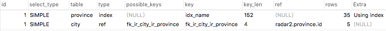

# 基础

## 字段长度

> 1. mysql中，数字类型和字符串类型均可设置长度，各类型所占字节数参见[mysql数据类型](http://www.runoob.com/mysql/mysql-data-types.html)
>
> 2. 上文中，类型分为两种：
>
>    + 所占字节数是固定的
>    + 所占字节数是不固定的，需要定义数据类型时指定其长度
>
> 3. 所以指定的长度，针对上述两种情况，这个长度的含义是不同的
>
>    + 对于本身字节数固定的类型，如`int(11)`，这个指定的长度表示`显示宽度`
>
>      + 存储数据时所占空间与该类型所占字节数有关，而与指定的长度无关
>
>      + 当指定字段类型时指定了该字段的`zerofull`属性，这个`显示宽度`才有用
>
>        如果设置1个字段类型为`int(3)`并指定了`zerofill`属性，插入数据`10`，则显示为`010`，如果插入`1000`，则正常显示为`1000`
>
>      + 综上所述，int类型指定长度时，这个长度只有在指定了该字段的`zerofill`属性并且插入的值小于这个长度时，才在显示的时候有所不同，否则没有任何用处。
>
>    + 对于本身字节数不固定的类型，如`varchar(50)`，这个指定的长度会影响该字段的最大存储空间

## 截断表

### truncate

> + 作用
>
>   删除表的所有数据，但不需要commit 
>
> + 语法
>
>   truncate table 表名 【reuse | drop storage 】
>
>   reuse storage关键字，表示删除记录后仍然保存记录占用的空间
>
>   drop storage关键字，表示删除记录后立即回收记录占用的空间.默认drop storage
>
> + 特点
>
>   删除表所有数据，保留表结构， 
>   删除数据的速度要比delete快,因为不会产生回退信息 
>   删除的数据无法恢复,除非reuse storage 
>   释放表所占用的磁盘空间 
>   不需要commit 

### truncate 对比 drop 对比 delete

+ drop
  + 删除表，不可回滚；一次性删除表的所有内容
+ truncate
  + 删除表中所有数据，默认不可回滚；一次性删除除表结构以外的所有内容
+ delete
  + 删除表中部分或全部数据，可回滚；一行一行删除数据，并保留一些日志信息等
+ 综合
  + 效率：drop > truncate > delete

### 应用

+ 使用delete删除表中所有数据后，再插入数据，会发现自增主键仍然继续之前的值进行递增，

  使用`truncate`自增主键就会重新开始自增

## 修复表

语法：REPAIR TABLE `table_name`

作用：用户修复被破坏的表

## 优化表

语法：OPTIMIZE TABLE `table_name` 

作用：用于回收闲置的数据库空间，当表上的数据行被删除时，所占据的磁盘空间并没有立即被回收，使用了OPTIMIZE TABLE命令后这些空间将被回收，并且对磁盘上的数据行进行重排

## 权限

> 管理员可以为用户分配两种权限：
>
> + 服务器权限
> + 数据库权限

### 权限概述

|          权限           |        权限级别        |                           权限说明                           |
| :---------------------: | :--------------------: | :----------------------------------------------------------: |
|          Alter          |           表           |                 更改表，比如添加字段、索引等                 |
|      Alter Routine      |        存储过程        |                       更改存储过程权限                       |
|         Create          |    数据库、表或索引    |                   创建数据库、表或索引权限                   |
|     Create Routine      |        存储过程        |                       创建存储过程权限                       |
| Create Temporary Tables |       服务器管理       |                        创建临时表权限                        |
|       Create User       |       服务器管理       |                         创建用户权限                         |
|       Create View       |          视图          |                         创建视图权限                         |
|         Delete          |           表           |                         删除数据权限                         |
|          Drop           |       数据库或表       |                      删除数据库或表权限                      |
|          Event          |       时间触发器       |                 创建，修改，执行Event的权限                  |
|         Execute         |        存储过程        |                   执行存储过程和函数的权限                   |
|          File           | 服务器主机上的文件访问 |                         文件访问权限                         |
|      Grant Option       | 数据库、表或保存的程序 |                      将自己权限授予别人                      |
|          Index          |           表           |                           索引权限                           |
|         Insert          |           表           |                           插入权限                           |
|       Lock Tables       |       服务器管理       |                           锁表权限                           |
|         Process         |       服务器管理       |                         查看进程权限                         |
|       References        |       数据库或表       |                           外键权限                           |
|         Reload          |       服务器管理       | 执行<br />flush-hosts, <br />flush-logs, <br />flush-privileges,<br /> flush-status,<br /> flush-tables, <br />flush-threads, <br />refresh, <br />reload<br />等命令的权限 |
|   Replication Client    |       服务器管理       |                      复制数据库相关权限                      |
|    Replication Slave    |       服务器管理       |                      复制数据库相关权限                      |
|         Select          |           表           |                           查询权限                           |
|     Show Databases      |       服务器管理       |                        查看数据库权限                        |
|        Show View        |          视图          |                         查看视图权限                         |
|        Shutdown         |       服务器管理       |                        关闭数据库权限                        |
|          Super          |       服务器管理       |                       执行kill线程权限                       |
|         Trigger         |       事件触发器       |                      使用事件触发器权限                      |
|         Update          |           表           |                           更新权限                           |

### 服务器权限

> 这里的服务器权限指的是物理上的数据库的权限
>
> 可分配上述所有权限

### 数据库权限

> 这里的数据库权限指的是数据库服务器中的database的权限
>
> 可分配权限如下：

+ Alter
+ Create
+ Create View
+ Delete
+ Drop
+ Grant Option
+ Index
+ Insert
+ References
+ Select
+ Show View
+ Trigger
+ Update

## 双机备份

> 双机备份分为2种：
>
> + 主从备份：从机备份主机的数据
>
> + 主主备份：就是两台数据库互相同步备份
>
>   主主备份就是把主从备份反过来再做一遍

### 原理

> + 把 一个服务器上执行过的sql语句在别的服务器上也重复执行一遍， 这样只要两个数据库的初态是一样的（不必须），那么它们就能一直同步。当然这种复制和重复都是mysql自动实现的，我们只需要配置即可。
>
> + 对于一个mysql服务器， 一般有两个线程来负责复制和被复制。当开启复制之后。
>
>   1. 作为主服务器Master，  会把自己的每一次改动都记录到 二进制日志 Binarylog 中。 （从服务器会负责来读取这个log， 然后在自己那里再执行一遍。）
>
>   2. 作为从服务器Slave， 会用master上的账号登陆到 master上， 读取master的Binarylog,  写入到自己的中继日志 Relaylog， 然后自己的sql线程会负责读取这个中继日志，并执行一遍。 

### 教程

> + [双击备份教程](https://blog.csdn.net/chenshiai/article/details/53611781)
> + [主从复制、备份恢复方案生产环境实战](https://www.cnblogs.com/suoning/p/5778243.html)
> + 如何解决误删主库问题，从数据库不是也会同步吗？
>

## 添加用户及授权

> $ grant all privileges on mq.* to 'test'@'localhost' identified by '1234';
>
> $ flush privileges;

# 数据库设计

>  以mysql为主，记录数据库的建表规范及优化方案等

## 阿里mysql规约

参见[阿里巴巴JAVA编程规范之MYSQL规约](https://blog.csdn.net/qq_19701185/article/details/55051126)

## DB设计三大范式

### 第一范式

> 数据库表中的字段都是单一属性的，不可再分。

+ 例：

  反例：

  | user_id | user_name | used_name  |
  | :-----: | :-------: | :--------: |
  |    1    |   alan    | linda，tom |

  正例：

  + user

    | user_id | user_name |
    | :-----: | :-------: |
    |    1    |   alan    |

  + used_name

    |  id  | user_id | name  |
    | :--: | :-----: | :---: |
    |  1   |    1    | linda |
    |  2   |    1    |  tom  |

### 第二范式

> 属性完全依赖于主键，不允许有属性不依赖或部分依赖主键

+ 例：

  + 反例

    + 不依赖于主键

      | user_id | user_name | balance |
      | :-----: | :-------: | :-----: |
      |    1    |   alan    |  1000   |

      > 说明：这里的`balance`字段要记录的是该用户的银行卡余额
      >
      > 因为银行卡余额依赖于银行卡，而不直接依赖于用户，所以这里不满足第二范式

    + 部分依赖于主键

      | user_id | card_num | user_name | balance |
      | :-----: | :------: | :-------: | :-----: |
      |    1    | 1000111  |   alan    |  1000   |

      > 说明：这里将`user_id`与`card_num`设置为联合主键，`balance`字段要记录的是该用户的银行卡余额
      >
      > 因为银行卡余额只依赖于银行卡就可以了，不需要依赖于用户，所以`balance`字段部分依赖于主键中的`card_num`，所以也不满足第二范式

  + 正例

    | local_id | food_id | evaluation |
    | :------: | :-----: | :--------: |
    |  110000  |  1020   |    good    |

    > 说明：`local_id`为地区，`food_id`为食物，前两个字段为联合主键，`evaluation`为对某地区的某个食物的评价
    >
    > 因为1个地区有很多种食物，1个食物也可能很多地区都有，所以必须通过联合主键才能确定后面评价的是哪个地区的食物，所以`evaluation`是完全依赖于主键的，所以满足第二范式

### 第三范式

> 一个表中不允许出现已经在其他表中存在的非关键字段

+ 例

  + 反例

    + user

      | user_id | car_id | car_color |
      | :-----: | :----: | :-------: |
      |    1    |   b1   |    red    |

    + car

      | car_id | car_color |
      | :----: | :-------: |
      |   b1   |    red    |

    > 上例中，user表中出现了已经在car表中定义了的`car_color`字段，`car_color`不是2个关键字段，所以不满足第三范式

  + 正例

    - user

      | user_id | car_id |
      | :-----: | :----: |
      |    1    |   b1   |

    - car

      | car_id | car_color |
      | :----: | :-------: |
      |   b1   |    red    |


## 索引

> + 索引的创建需要根据查询语句决定
> + 资料参见[博客](https://www.cnblogs.com/lxmyhappy/p/7387921.html)

+ 单列索引

  > + 单列索引指的就是1个索引中只包含1个字段
  > + 如果`where`中出现了两个单列索引，mysql会选择重复度较低的索引

+ 联合索引

  > + 联合索引指的就是1个索引中包含了同一张表中的多个字段
  >
  > + 最左原则
  >
  >   建立联合索引时，需要考虑联合索引中几个字段先后顺序，如：
  >
  >   创建索引时字段顺序为：A、B、C，则使用`A`、`A、B`、`A、B、C`字段进行查找时，会使用该索引，但是使用`B`、`B、C`、`C`进行查询时，不会使用该索引

+ 索引长度

  > 给字符类型字段创建索引时，如果该字段的前n个字节就基本可以确定该条记录，就指定索引长度为n，就不需要创建整列的索引了，这样可以大大节省索引空间

+ 如何选择创建单列索引还是组合索引

  > 当`where`中出现了多个字段的查询条件时，此时即可以创建单列索引，也可以创建联合索引，至于选择创建哪种索引，需要根据数据确定

  + 如果多个字段中，有1个字段已经基本可以定位到要查询的记录时，那就选择创建该字段的单列索引

    > 如：`name`和`age`字段，name的重复率很低，基本已经可以确定1个用户时，就创建`name`字段的单列索引

  + 如果多个字段中，没有1个字段可以基本定位到要查询的记录，需要多个字段一起定位时，需要使用联合索引

    > 如：
    >
    > 大学选认课老师，需要创建一个关系对应表，有2个字段,student_id 和 teacher_id，想要查询某个老师和某个学生是否存在师生关系。 
    > 一个学生会选几十个老师，一个老师会带几百个学生 。如果只为student_id建立索引的情况下，经过索引会选出几十条记录，然后在内存中where一下，去除其余的老师。 
    > 相反如果只为teacher_id建立索引，经过索引会选出几百条记录，然后在内存中where一下，去除其余的学生。 
    > 两种情况都不是最优的，这个时候使用联合索引最合适，通过索引直接找到对应记录。

+ 以下情况即使创建了索引也不会使用索引

  > 使用like对索引字段进行模糊查询时，不走索引；
  > 对索引字段使用表达式时，也不走索引

## 主键设计

> 参考文档：
>
>  [mysql主键设计](https://www.cnblogs.com/xiekeli/p/5398374.html)
>
> [自增主键与UUID主键优劣势实验](https://blog.csdn.net/mchdba/article/details/52336203)

### 原则

> 以下原则是需要根据场景进行调整的，并不绝对

+ MySQL主键应当是对用户没有意义的。

  > 不绝对，有时为了节省空间，或为了让数据按一定顺序（如时间）在数据库中排列，可以违背该原则

+ MySQL主键应该是单列的，以便提高连接和筛选操作的效率

  > 不绝对，对表进行水平分割时，可能会使用组合主键

+ 永远也不要更新MySQL主键

  > 绝对

+ MySQL主键不应包含动态变化的数据，如时间戳、创建时间列、修改时间列等

  > 不绝对，有时为了为了让数据按时间顺序在数据库中排列，可以违背该原则

+ MySQL主键应当有计算机自动生成。

  > 不绝对，使用UUID或自定义序列表维护主键时，主键违背了该原则

+ 主键应该是整形，尽量避免字符型

  > 字符型很消耗空间，且通常比数字类型慢。

### 常用方案

+ 自增id

  + 优点

    > 1. 数据库自动编号，速度快，而且是增量增长，聚集型主键按顺序存放，对于检索非常有利。
    >
    > 2.  数字型，占用空间小，易排序，在程序中传递方便。

  + 缺点

    > 1. 不支持水平分片架构，水平分片的设计当中，这种方法显然不能保证全局唯一。
    > 2. 自增主键不连续

+ UUID

  + 优点

    > 1. 全局唯一性、安全性、可移植性。
    >
    > 2. 能够保证独立性，程序可以在不同的数据库间迁移，效果不受影响。
    >
    > 3. 保证生成的ID不仅是表独立的，而且是库独立的，在你切分数据库的时候尤为重要

  + 缺点

    > 1. 针对InnoDB引擎会徒增IO压力，InnoDB为聚集主键类型的引擎，数据会按照主键进行排序，由于UUID的无序性，InnoDB会产生巨大的IO压力。InnoDB主键索引和数据存储位置相关（簇类索引），uuid 主键可能会引起数据位置频繁变动，严重影响性能。
    >
    > 2. UUID长度过长，一个UUID占用128个比特（16个字节）。主键索引KeyLength长度过大，而影响能够基于内存的索引记录数量，进而影响基于内存的索引命中率，而基于硬盘进行索引查询性能很差。严重影响数据库服务器整体的性能表现。

+ 自定义序列表

  > 所谓自定义序列表，就是使用`LAST_INSERT_ID(id+1)`来获取新的id

### 水平分片

> 在分布式系统中，或避免1张表过大时，需要将1张表拆分成多张表，此时需要保证主键全局唯一
>
> 为了满足该需求，有以下几种方案：

+ UUID

  由于UUID出现重复的概率基本可以忽略，所以对分片是天生支持的。

+ 独立的序列库

  单独建一张表来维护id，影响性能

+ 复合主键

  通过两个字段来生成一个唯一标识，前半部分是分片标识符，后半部分是本地生成的标识符

+ 带分库策略的自定义序列表

  将上述`自定义序列表`策略变形，每次自增值变为节点数

+ 自增id+步长

  自增id每次增加数为节点数

+ 雪花算法自造全局自增ID

  性能最好的方案，待实验

## 数据库优化

### 数据库优化工具

+ `explain`

  > 资料参见：[EXPLAIN命令详解](https://www.cnblogs.com/gomysql/p/3720123.html)
  >
  > 在要执行的语句前加上`explain`，可以看到这个语句的执行过程，是否使用索引等

  例如执行：

  ```sql
  explain select province.id,province.name,city.id,city.name from province LEFT JOIN city on province.id=city.province_id
  ```

  结果如下：

  

  字段解释：

  + id

    > 数字越大的越先执行
    >
    > 数字相同的执行顺序由上而下
    >
    > id为NULL的最后执行

  + select_type

    > 每个select子句的查询类型
    >
    > 主要分为以几种：

    + SIMPLE

      整个查询如果不包含子查询或UNION，则最外层select子句是SIMPLE类型

    + PROMARY

      整个查询如果包含任何复杂的子部分，则最外层select子句是PROMARY类型

    + SUBQUERY

      在select或where列表中的select子句被标记为SUBQUERY

    + DRIVED

      在from列表中的select子句会被标记为DRIVED

      > 因为在from列表中的select子句执行后的结果还会被用到，所以需要将查询结果作为一个临时表暂时存起来，这种能够产生临时表的select子句就会被标记为DRIVED

    + UNION

      出现在关键字`union`之后的最外层select子句被标记为UNION

  + table

    > 当前select子句操作的表

    + 如果操作的是数据库中存在的表，则该列为表名

    + 如果操作的是临时表，则该列内容中的数字就代表id为几的子句产生的临时表

      如：

      

      `<drived2>`代表操作的是id为2的子句产生的临时表

  + type

    > 表示MySQL在表中找到所需行的方式，又称“访问类型”，常见类型如下:
    >
    >  ALL, index,  range, ref, eq_ref, const, system, NULL
    >
    > 从左到右，性能从最差到最好

    + ALL

      全盘扫描

    + index

      遍历索引树

    + range

      范围索引扫描，遍历部分索引，当where子句中使用between、>、<、IN、OR等时，会使用范围索引

    + ref

      使用非唯一索引（或者唯一索引的前缀）扫描，返回匹配某个单独值的记录行

    + eq-ref

      使用唯一索引扫描

    + const

      当selelct子句的wehere列表中包含主键时，该查询会被转换为常量

    + system

      当查询的表只有1行时

    + NULL

      mysql对语句进行优化后，不需要访问表或索引就可以得到结果

      如在索引列中查找最小值

  + possible_keys

    查询涉及到的索引列，会在这列被列出来

  + key

    查询中使用到的索引列

  + key_len

    表示索引中使用的字节数，可通过该列计算查询中使用的索引的长度（key_len显示的值为索引字段的最大可能长度，并非实际使用长度，即key_len是根据表定义计算而得，不是通过表内检索出的）

  + ref

    表示操作的表的连接匹配条件，即哪些列或常量被用于查找索引列上的值

  + rows

    表示MySQL根据表统计信息及索引选用情况，估算的找到所需的记录所需要读取的行数

  + Extra

    不适合在其他列中显示但十分重要的额外信息

### 优化手段

> 参考资料：
>
> [数据库SQL优化大总结1之- 百万级数据库优化方案](https://blog.csdn.net/wuhuagu_wuhuaguo/article/details/72875054)
>
>

+ 创建索引

  > + 尽量避免全盘扫描，对查询条件字段创建索引
  > + 大字段不适合创建索引

+ 尽量避免使用NULL值

  > + null不参加索引，会导致全盘扫描

+ 尽量避免使用`!=`和`<>`

  > `不等于`会导致查询不走索引

+ 尽量避免在非索引字段上使用`or`

  > or的两侧的任何一个字段是非索引字段，都会导致整个select子句不走索引
  >
  > 可以使用union代替

+ 尽量避免使用`not in`

  > + 在mysql中，`in`是走索引的，`not in`是不走索引的
  >
  >   当`[not] in`后面是子查询时，可以使用多表联查代替
  >
  >   当`[not] in`后面是数组时，`in`是走索引的，可以直接使用；`not in`应尽量避免，实在避免不了的，应该将`not in`用在小表中，大表使用其他方式与小表进行关联
  >
  > + [exists与in的用法](https://blog.csdn.net/J080624/article/details/72910548)

+ 慎用`like`

  > 对字符串字段的开头使用模糊查询将导致全盘扫描

  ```sql
  select * from city where name like '吉%'		#使用索引
  select * from city where name like '%市%'	#不使用索引
  ```

+  where子句中`=`左边只能是字段名，否则可能导致全盘扫描

  ```sql
  select id from t where num/2 = 100
  ```

  可优化为

  ```sql
  select id from t where num = 100*2
  ```

+ 尽量`使用整形`而不要使用字符型

+ 字符型`尽量使用变长类型`

+ 尽量避免查询时`返回用不到的字段`

+ 避免`返回数据过大`

  > 这会造成IO繁忙，一般需要分页

+ 避免`隐式类型转换`

  > `隐式类型转换`本身就是增加成本，而且又是还会导致不走索引