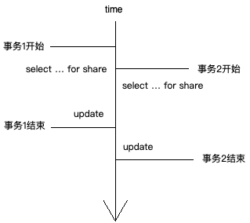
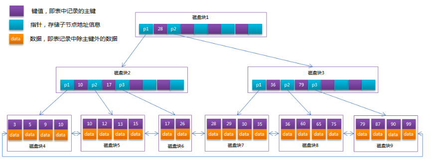
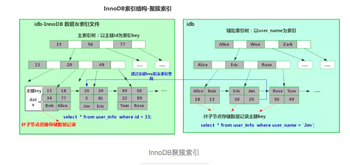

# 基础

## 截断表

### truncate

> + 作用
>
>   删除表的所有数据，但不需要commit 
>
> + 语法
>
>   truncate table 表名 【reuse | drop storage 】
>
>   reuse storage关键字，表示删除记录后仍然保存记录占用的空间
>
>   drop storage关键字，表示删除记录后立即回收记录占用的空间.默认drop storage
>
> + 特点
>
>   删除表所有数据，保留表结构， 
>   删除数据的速度要比delete快,因为不会产生回退信息 
>   删除的数据无法恢复,除非reuse storage 
>   释放表所占用的磁盘空间 
>   不需要commit 

### truncate 对比 drop 对比 delete

+ drop
  + 删除表，不可回滚；一次性删除表的所有内容
+ truncate
  + 删除表中所有数据，默认不可回滚；一次性删除除表结构以外的所有内容
+ delete
  + 删除表中部分或全部数据，可回滚；一行一行删除数据，并保留一些日志信息等
+ 综合
  + 效率：drop > truncate > delete

### 应用

+ 使用delete删除表中所有数据后，再插入数据，会发现自增主键仍然继续之前的值进行递增，

  使用`truncate`自增主键就会重新开始自增

## 修复表

语法：REPAIR TABLE `table_name`

作用：用户修复被破坏的表

## 优化表

语法：OPTIMIZE TABLE `table_name` 

作用：用于回收闲置的数据库空间，当表上的数据行被删除时，所占据的磁盘空间并没有立即被回收，使用了OPTIMIZE TABLE命令后这些空间将被回收，并且对磁盘上的数据行进行重排

## 权限

> 管理员可以为用户分配两种权限：
>
> + 服务器权限
> + 数据库权限

### 权限概述

|          权限           |        权限级别        |                           权限说明                           |
| :---------------------: | :--------------------: | :----------------------------------------------------------: |
|          Alter          |           表           |                 更改表，比如添加字段、索引等                 |
|      Alter Routine      |        存储过程        |                       更改存储过程权限                       |
|         Create          |    数据库、表或索引    |                   创建数据库、表或索引权限                   |
|     Create Routine      |        存储过程        |                       创建存储过程权限                       |
| Create Temporary Tables |       服务器管理       |                        创建临时表权限                        |
|       Create User       |       服务器管理       |                         创建用户权限                         |
|       Create View       |          视图          |                         创建视图权限                         |
|         Delete          |           表           |                         删除数据权限                         |
|          Drop           |       数据库或表       |                      删除数据库或表权限                      |
|          Event          |       时间触发器       |                 创建，修改，执行Event的权限                  |
|         Execute         |        存储过程        |                   执行存储过程和函数的权限                   |
|          File           | 服务器主机上的文件访问 |                         文件访问权限                         |
|      Grant Option       | 数据库、表或保存的程序 |                      将自己权限授予别人                      |
|          Index          |           表           |                           索引权限                           |
|         Insert          |           表           |                           插入权限                           |
|       Lock Tables       |       服务器管理       |                           锁表权限                           |
|         Process         |       服务器管理       |                         查看进程权限                         |
|       References        |       数据库或表       |                           外键权限                           |
|         Reload          |       服务器管理       | 执行<br />flush-hosts, <br />flush-logs, <br />flush-privileges,<br /> flush-status,<br /> flush-tables, <br />flush-threads, <br />refresh, <br />reload<br />等命令的权限 |
|   Replication Client    |       服务器管理       |                      复制数据库相关权限                      |
|    Replication Slave    |       服务器管理       |                      复制数据库相关权限                      |
|         Select          |           表           |                           查询权限                           |
|     Show Databases      |       服务器管理       |                        查看数据库权限                        |
|        Show View        |          视图          |                         查看视图权限                         |
|        Shutdown         |       服务器管理       |                        关闭数据库权限                        |
|          Super          |       服务器管理       |                       执行kill线程权限                       |
|         Trigger         |       事件触发器       |                      使用事件触发器权限                      |
|         Update          |           表           |                           更新权限                           |

### 服务器权限

> 这里的服务器权限指的是物理上的数据库的权限
>
> 可分配上述所有权限

### 数据库权限

> 这里的数据库权限指的是数据库服务器中的database的权限
>
> 可分配权限如下：

+ Alter
+ Create
+ Create View
+ Delete
+ Drop
+ Grant Option
+ Index
+ Insert
+ References
+ Select
+ Show View
+ Trigger
+ Update

## 双机备份

> 双机备份分为2种：
>
> + 主从备份：从机备份主机的数据
>
> + 主主备份：就是两台数据库互相同步备份
>
>   主主备份就是把主从备份反过来再做一遍

### 原理

> + 把 一个服务器上执行过的sql语句在别的服务器上也重复执行一遍， 这样只要两个数据库的初态是一样的（不必须），那么它们就能一直同步。当然这种复制和重复都是mysql自动实现的，我们只需要配置即可。
>
> + 对于一个mysql服务器， 一般有两个线程来负责复制和被复制。当开启复制之后。
>
>   1. 作为主服务器Master，  会把自己的每一次改动都记录到 二进制日志 Binarylog 中。 （从服务器会负责来读取这个log， 然后在自己那里再执行一遍。）
>
>   2. 作为从服务器Slave， 会用master上的账号登陆到 master上， 读取master的Binarylog,  写入到自己的中继日志 Relaylog， 然后自己的sql线程会负责读取这个中继日志，并执行一遍。 

### 教程

> + [双击备份教程](https://blog.csdn.net/chenshiai/article/details/53611781)
> + [主从复制、备份恢复方案生产环境实战](https://www.cnblogs.com/suoning/p/5778243.html)
> + 如何解决误删主库问题，从数据库不是也会同步吗？
>

## 授权远程登录

> 授权信息的记录在mysql.user表中

+ 查看授权

  ```shell
  select * from user
  ```

+ 新增、修改授权

  ```shell
  $ grant all privileges on mq.* to 'test'@'localhost' identified by '1234';
  $ flush privileges;
  ```

  实际上是根据`User`和`Host`字段新增或修改`user`表中记录

+ 取消授权

  ```shell
  $ revoke all privileges on *.* from root@localhost; 
  $ flush privileges;
  ```

  > 只是将user表中所有权限字段设为`N`

+ 删除用户

  ```shell
  delete from user where User='root' and Host='*';
  ```

  > 真正的删除了user表中用户

## 编码

### 字符集

+ mysql字符编码尽量选择`utf8mb4`
+ `utf8`与`utf8mb4`区别
  + `utf8`实际上是`utf8mb3`，使用3个字节存储字符，支持的字符更好，存储到部分字符的时候会报错
  + `utf8mb4`使用4个字节存储，支持的字符更多
+ 默认字符集
  + `mysql5.7`默认字符集为`latin1`
  + `mysql8.0`默认字符集为`utf8mb4`

### 排序规则

+ 两个不同的字符集没有相同的排序规则

+ 字符集命名规则

  + `_ci`结尾：大小写不敏感
  + `_cs`结尾：大小写敏感
  + `_bin`结尾：二进制比较

+ 如果`字符集`选择为`utf8mb4`，则字符编码一般选择为`utf8mb4_general_ci`

+ 临时区分大小写

  临时区分大小写有两种方式：

  + 字段前加`binary`
  + 指定字段条件后加`collate [排序规则]`

  如：

  + 表

    | id   | name |
    | ---- | ---- |
    | 1    | a    |
    | 2    | A    |
    | 3    | b    |

  + sql

    | sql                                                       | 结果  |
    | --------------------------------------------------------- | ----- |
    | select * from test order by name                          | a A b |
    | select * from test order by BINARY name                   | A a b |
    | select * from test order by name COLLATE utf8mb4_bin      | A a b |
    | select * from test where name='a'                         | a A   |
    | select * from test where binary name='a'                  | a     |
    | select * from test where name='admin' COLLATE utf8mb4_bin | a     |

  `binary`与`COLLATE [排序规则]`都是形容某`1个字段`的，如果多个字段需要指定，则需要指定多次

## 锁

### 悲观锁、乐观锁

> 参见[MySQL 乐观锁与悲观锁](https://www.jianshu.com/p/f5ff017db62a) 

- 悲观锁

  - 什么是悲观锁

    每次拿数据的时候，都悲观的认为，别人会修改这条数据，所以每次拿数据的时候就会上锁

  - 实现方式

    使用排它锁和共享锁

- 乐观锁

  每次拿数据的时候，乐观的认为，别人不会修改数据，不会上锁，但是表中会增加1个字段（版本字段或时间戳字段）作为锁，读的时候读出该字段的值，`update`的时候需要逐条进行更新，将每条记录该字段和读出来的值作为条件进行修改，锁字段需要更新（版本字段自增或时间戳字段更新），通过判断`update`语句返回的修改行数是否为1，判断是否修改成功，如果不成功，重新执行此步骤

### 排它锁、共享锁

> 参见[MySQL中的共享锁与排他锁](https://www.hollischuang.com/archives/923) 

+ 必须在事务中使用共享锁、排它锁，事务结束后释放锁

+ 使用锁

  - `select`

    - 排它锁

      ```sql
      select * from test for update
      ```

    - 共享锁

      - mysql5.7

        ```sql
        select * from test lock in share mode
        ```

      - mysql8.0

        ```sql
        select * from test lock in share mode
        # 或
        select * from test for share
        ```

  - `insert`、`update`、`delete`

    这些语句只能使用排它锁，并且是自动使用

+ 原理

  + 一个事务中，执行1条sql，根据`锁级别`的判定条件，为部分字段加上行级锁或表级锁；另一个事务中执行sql的时候会尝试获取某些行的某些字段的锁，如果已经被锁，则根据`互斥原则`决定是否可以获取到锁，获取成功后，执行sql，该事务一定会再对该行的该字段进行加锁

  + 对于相同的几行记录，1个字段可以被多个事务加锁，但是1个字段只能被1个事务加一种类型的锁

    加锁时不同事务之间互不影响，同一个事务中：

    + 先加共享，后加排他，最后是排他
    + 先加排他，后加共享，最后也是排他

    获取锁时，不同事物之间会有影响，参见`互斥原则`

+ 互斥原则

  一个事务中的悲观锁与另一个事务中的任何锁互斥

  一个事务中的共享锁与另一个事务中的共享锁不互斥

  一个事务中的语句不存在锁的概念

+ `select`使用共享锁与排它锁区别

  + 共享锁

    + 共享锁解决了如下问题

      事务1对某条数据加了排它锁，并且事务1结束之前，这段时间，我们认为事务1正在修改该数据，此时该数据是不稳定的，此时的数据即使被读出也可能是错误数据，对于这样的数据，使用了共享锁后，就不会被读出

    + 但是共享锁没有解决如下问题

        

      如上图，事务1、2同时查询同一条数据，事务1执行update后结束事务，此时事务2执行update，但是此次更新是基于事务1更新之前的数据进行更新的，所以会导致数据出错

  + 排它锁

    对于上面遗留的问题，如果select语句使用排它锁，则事务2的读操作就不会执行成功，只有事务1结束后，事务2才能查询，这样就解决了这个问题

+ 互斥处理

  > 参见[MySQL8.0新特性集锦](https://www.jianshu.com/p/be29467c2b0c) 

  + mysql5.7

    获取不到锁时就是阻塞

  + musql8.0

    新增语法`nowait`、`skip locked`

    + nowait

      获取不到锁时立即返回报错

      ```sql
      select * from t1 where c1 = 2 for update nowait;
      ```

    + skip locked

      获取不到锁时跳过被锁住的行，立即返回其他行数据

      ```sql
      select * from t1 where c1 = 2 for update skip locked
      ```

### 行锁、表锁、页锁

> 参见[MySQL中的行级锁,表级锁,页级锁](https://www.hollischuang.com/archives/914) 

#### 介绍

+ 行锁

  行锁只能锁重复率较低的索引字段，并且锁住的是`满足条件的索引字段的值`，而不是表中的哪行记录

  如：查询条件中有一个条件为年龄=28，并且该字段存在索引，则对该字段加行锁时，锁住的是年龄索引树上`28`这个值，也就意味着，表中所有年龄为28的记录，该字段都被锁住了

   

+ 表锁

  锁住的是该表中的字段属性，锁住该字段属性，则整表中所有记录的该字段都被锁住了

+ 页锁

  一次锁一页(相邻的一组数据)

  性能介于表锁与行锁之间

#### 判断使用哪种锁

> 参见[数据库：Mysql中“select ... for update”排他锁分析](https://blog.csdn.net/claram/article/details/54023216) 

- 是否需要查到数据

  - 表锁不需要查到数据
  - 行锁需要查到数据，并对查到的记录进行行锁

- 什么时候产生什么锁

  - select … for

    - 非索引字段：表锁

    - 普通索引字段

      - 条件为`<>`或`like`：表锁

      - 其他条件

        - 该字段重复率高

          此时mysql不会把这个索引当做索引看(相当于没有建索引)，会升级为表锁

        - 该字段重复率低：行锁

    - 主键、唯一索引

      - 条件为`<>`或`like`：表锁
      - 其他条件：行锁

  - insert、update、delete

    行锁

# 数据库设计

>  以mysql为主，记录数据库的建表规范及优化方案等

## 阿里mysql规约

参见[阿里巴巴JAVA编程规范之MYSQL规约](https://blog.csdn.net/qq_19701185/article/details/55051126)

## DB设计三大范式

### 第一范式

> 数据库表中的字段都是单一属性的，不可再分。

+ 例：

  反例：

  | user_id | user_name | used_name  |
  | :-----: | :-------: | :--------: |
  |    1    |   alan    | linda，tom |

  正例：

  + user

    | user_id | user_name |
    | :-----: | :-------: |
    |    1    |   alan    |

  + used_name

    |  id  | user_id | name  |
    | :--: | :-----: | :---: |
    |  1   |    1    | linda |
    |  2   |    1    |  tom  |

### 第二范式

> 属性完全依赖于主键，不允许有属性不依赖或部分依赖主键

+ 例：

  + 反例

    + 不依赖于主键

      | user_id | user_name | balance |
      | :-----: | :-------: | :-----: |
      |    1    |   alan    |  1000   |

      > 说明：这里的`balance`字段要记录的是该用户的银行卡余额
      >
      > 因为银行卡余额依赖于银行卡，而不直接依赖于用户，所以这里不满足第二范式

    + 部分依赖于主键

      | user_id | card_num | user_name | balance |
      | :-----: | :------: | :-------: | :-----: |
      |    1    | 1000111  |   alan    |  1000   |

      > 说明：这里将`user_id`与`card_num`设置为联合主键，`balance`字段要记录的是该用户的银行卡余额
      >
      > 因为银行卡余额只依赖于银行卡就可以了，不需要依赖于用户，所以`balance`字段部分依赖于主键中的`card_num`，所以也不满足第二范式

  + 正例

    | local_id | food_id | evaluation |
    | :------: | :-----: | :--------: |
    |  110000  |  1020   |    good    |

    > 说明：`local_id`为地区，`food_id`为食物，前两个字段为联合主键，`evaluation`为对某地区的某个食物的评价
    >
    > 因为1个地区有很多种食物，1个食物也可能很多地区都有，所以必须通过联合主键才能确定后面评价的是哪个地区的食物，所以`evaluation`是完全依赖于主键的，所以满足第二范式

### 第三范式

> 一个表中不允许出现已经在其他表中存在的非关键字段

+ 例

  + 反例

    + user

      | user_id | car_id | car_color |
      | :-----: | :----: | :-------: |
      |    1    |   b1   |    red    |

    + car

      | car_id | car_color |
      | :----: | :-------: |
      |   b1   |    red    |

    > 上例中，user表中出现了已经在car表中定义了的`car_color`字段，`car_color`不是2个关键字段，所以不满足第三范式

  + 正例

    - user

      | user_id | car_id |
      | :-----: | :----: |
      |    1    |   b1   |

    - car

      | car_id | car_color |
      | :----: | :-------: |
      |   b1   |    red    |


## 索引

> + 索引的创建需要根据查询语句决定
> + 资料参见[博客](https://www.cnblogs.com/lxmyhappy/p/7387921.html)

+ 单列索引

  > + 单列索引指的就是1个索引中只包含1个字段
  > + 如果`where`中出现了两个单列索引，mysql会选择重复度较低的索引

+ 联合索引

  > + 联合索引指的就是1个索引中包含了同一张表中的多个字段
  >
  > + 最左原则
  >
  >   建立联合索引时，需要考虑联合索引中几个字段先后顺序，如：
  >
  >   创建索引时字段顺序为：A、B、C，则使用`A`、`A、B`、`A、B、C`字段进行查找时，会使用该索引，但是使用`B`、`B、C`、`C`进行查询时，不会使用该索引

+ 索引长度

  > 给字符类型字段创建索引时，如果该字段的前n个字节就基本可以确定该条记录，就指定索引长度为n，就不需要创建整列的索引了，这样可以大大节省索引空间

+ 如何选择创建单列索引还是组合索引

  > 当`where`中出现了多个字段的查询条件时，此时即可以创建单列索引，也可以创建联合索引，至于选择创建哪种索引，需要根据数据确定

  + 如果多个字段中，有1个字段已经基本可以定位到要查询的记录时，那就选择创建该字段的单列索引

    > 如：`name`和`age`字段，name的重复率很低，基本已经可以确定1个用户时，就创建`name`字段的单列索引

  + 如果多个字段中，没有1个字段可以基本定位到要查询的记录，需要多个字段一起定位时，需要使用联合索引

    > 如：
    >
    > 大学选认课老师，需要创建一个关系对应表，有2个字段,student_id 和 teacher_id，想要查询某个老师和某个学生是否存在师生关系。 
    > 一个学生会选几十个老师，一个老师会带几百个学生 。如果只为student_id建立索引的情况下，经过索引会选出几十条记录，然后在内存中where一下，去除其余的老师。 
    > 相反如果只为teacher_id建立索引，经过索引会选出几百条记录，然后在内存中where一下，去除其余的学生。 
    > 两种情况都不是最优的，这个时候使用联合索引最合适，通过索引直接找到对应记录。

+ 以下情况即使创建了索引也不会使用索引

  > 使用like对索引字段进行模糊查询时，不走索引；
  > 对索引字段使用表达式时，也不走索引
  
+ 无效索引

  > 参见：[MySQL 避免行锁升级为表锁——使用高效的索引](https://juejin.im/post/58f04e6b61ff4b0058e33d77) 

  当创建索引的字段重复率较高时，mysql不会把该字段当做索引使用(相当于没建索引)

## 主键设计

> 参考文档：
>
>  [mysql主键设计](https://www.cnblogs.com/xiekeli/p/5398374.html)
>
> [自增主键与UUID主键优劣势实验](https://blog.csdn.net/mchdba/article/details/52336203)

### 原则

> 以下原则是需要根据场景进行调整的，并不绝对

+ MySQL主键应当是对用户没有意义的。

  > 不绝对，有时为了节省空间，或为了让数据按一定顺序（如时间）在数据库中排列，可以违背该原则

+ MySQL主键应该是单列的，以便提高连接和筛选操作的效率

  > 不绝对，对表进行水平分割时，可能会使用组合主键

+ 永远也不要更新MySQL主键

  > 绝对

+ MySQL主键不应包含动态变化的数据，如时间戳、创建时间列、修改时间列等

  > 不绝对，有时为了为了让数据按时间顺序在数据库中排列，可以违背该原则

+ MySQL主键应当有计算机自动生成。

  > 不绝对，使用UUID或自定义序列表维护主键时，主键违背了该原则

+ 主键应该是整形，尽量避免字符型

  > 字符型很消耗空间，且通常比数字类型慢。

### 常用方案

+ 自增id

  + 优点

    > 1. 数据库自动编号，速度快，而且是增量增长，聚集型主键按顺序存放，对于检索非常有利。
    >
    > 2.  数字型，占用空间小，易排序，在程序中传递方便。

  + 缺点

    > 1. 不支持水平分片架构，水平分片的设计当中，这种方法显然不能保证全局唯一。
    > 2. 自增主键不连续

+ UUID

  + 优点

    > 1. 全局唯一性、安全性、可移植性。
    >
    > 2. 能够保证独立性，程序可以在不同的数据库间迁移，效果不受影响。
    >
    > 3. 保证生成的ID不仅是表独立的，而且是库独立的，在你切分数据库的时候尤为重要

  + 缺点

    > 1. 针对InnoDB引擎会徒增IO压力，InnoDB为聚集主键类型的引擎，数据会按照主键进行排序，由于UUID的无序性，InnoDB会产生巨大的IO压力。InnoDB主键索引和数据存储位置相关（簇类索引），uuid 主键可能会引起数据位置频繁变动，严重影响性能。
    >
    > 2. UUID长度过长，一个UUID占用128个比特（16个字节）。主键索引KeyLength长度过大，而影响能够基于内存的索引记录数量，进而影响基于内存的索引命中率，而基于硬盘进行索引查询性能很差。严重影响数据库服务器整体的性能表现。

+ 自定义序列表

  > 所谓自定义序列表，就是使用`LAST_INSERT_ID(id+1)`来获取新的id

### 水平分片

> 在分布式系统中，或避免1张表过大时，需要将1张表拆分成多张表，此时需要保证主键全局唯一
>
> 为了满足该需求，有以下几种方案：

+ UUID

  由于UUID出现重复的概率基本可以忽略，所以对分片是天生支持的。

+ 独立的序列库

  单独建一张表来维护id，影响性能

+ 复合主键

  通过两个字段来生成一个唯一标识，前半部分是分片标识符，后半部分是本地生成的标识符

+ 带分库策略的自定义序列表

  将上述`自定义序列表`策略变形，每次自增值变为节点数

+ 自增id+步长

  自增id每次增加数为节点数

+ 雪花算法自造全局自增ID

  性能最好的方案，待实验

## 数据库优化

### 数据库优化工具

+ `explain`

  > 资料参见：[EXPLAIN命令详解](https://www.cnblogs.com/gomysql/p/3720123.html)
  >
  > 在要执行的语句前加上`explain`，可以看到这个语句的执行过程，是否使用索引等

  例如执行：

  ```sql
  explain select province.id,province.name,city.id,city.name from province LEFT JOIN city on province.id=city.province_id
  ```

  结果如下：

  

  字段解释：

  + id

    > 数字越大的越先执行
    >
    > 数字相同的执行顺序由上而下
    >
    > id为NULL的最后执行

  + select_type

    > 每个select子句的查询类型
    >
    > 主要分为以几种：

    + SIMPLE

      整个查询如果不包含子查询或UNION，则最外层select子句是SIMPLE类型

    + PROMARY

      整个查询如果包含任何复杂的子部分，则最外层select子句是PROMARY类型

    + SUBQUERY

      在select或where列表中的select子句被标记为SUBQUERY

    + DRIVED

      在from列表中的select子句会被标记为DRIVED

      > 因为在from列表中的select子句执行后的结果还会被用到，所以需要将查询结果作为一个临时表暂时存起来，这种能够产生临时表的select子句就会被标记为DRIVED

    + UNION

      出现在关键字`union`之后的最外层select子句被标记为UNION

  + table

    > 当前select子句操作的表

    + 如果操作的是数据库中存在的表，则该列为表名

    + 如果操作的是临时表，则该列内容中的数字就代表id为几的子句产生的临时表

      如：

      

      `<drived2>`代表操作的是id为2的子句产生的临时表

  + type

    > 表示MySQL在表中找到所需行的方式，又称“访问类型”，常见类型如下:
    >
    >  ALL, index,  range, ref, eq_ref, const, system, NULL
    >
    > 从左到右，性能从最差到最好

    + ALL

      全盘扫描

    + index

      遍历索引树

    + range

      范围索引扫描，遍历部分索引，当where子句中使用between、>、<、IN、OR等时，会使用范围索引

    + ref

      使用非唯一索引（或者唯一索引的前缀）扫描，返回匹配某个单独值的记录行

    + eq-ref

      使用唯一索引扫描

    + const

      当selelct子句的wehere列表中包含主键时，该查询会被转换为常量

    + system

      当查询的表只有1行时

    + NULL

      mysql对语句进行优化后，不需要访问表或索引就可以得到结果

      如在索引列中查找最小值

  + possible_keys

    查询涉及到的索引列，会在这列被列出来

  + key

    查询中使用到的索引列

  + key_len

    表示索引中使用的字节数，可通过该列计算查询中使用的索引的长度（key_len显示的值为索引字段的最大可能长度，并非实际使用长度，即key_len是根据表定义计算而得，不是通过表内检索出的）

  + ref

    表示操作的表的连接匹配条件，即哪些列或常量被用于查找索引列上的值

  + rows

    表示MySQL根据表统计信息及索引选用情况，估算的找到所需的记录所需要读取的行数

  + Extra

    不适合在其他列中显示但十分重要的额外信息

### 优化手段

> 参考资料：
>
> [数据库SQL优化大总结1之- 百万级数据库优化方案](https://blog.csdn.net/wuhuagu_wuhuaguo/article/details/72875054)
>
>

+ 创建索引

  > + 尽量避免全盘扫描，对查询条件字段创建索引
  > + 大字段不适合创建索引

+ 尽量避免使用NULL值

  > + null不参加索引，会导致全盘扫描

+ 尽量避免使用`!=`和`<>`

  > `不等于`会导致查询不走索引

+ 尽量避免在非索引字段上使用`or`

  > or的两侧的任何一个字段是非索引字段，都会导致整个select子句不走索引
  >
  > 可以使用union代替

+ 尽量避免使用`not in`

  > + 在mysql中，`in`是走索引的，`not in`是不走索引的
  >
  >   当`[not] in`后面是子查询时，可以使用多表联查代替
  >
  >   当`[not] in`后面是数组时，`in`是走索引的，可以直接使用；`not in`应尽量避免，实在避免不了的，应该将`not in`用在小表中，大表使用其他方式与小表进行关联
  >
  > + [exists与in的用法](https://blog.csdn.net/J080624/article/details/72910548)

+ 慎用`like`

  > 对字符串字段的开头使用模糊查询将导致全盘扫描

  ```sql
  select * from city where name like '吉%'		#使用索引
  select * from city where name like '%市%'	#不使用索引
  ```

+  where子句中`=`左边只能是字段名，否则可能导致全盘扫描

  ```sql
  select id from t where num/2 = 100
  ```

  可优化为

  ```sql
  select id from t where num = 100*2
  ```

+ 尽量`使用整形`而不要使用字符型

+ 字符型`尽量使用变长类型`

+ 尽量避免查询时`返回用不到的字段`

+ 避免`返回数据过大`

  > 这会造成IO繁忙，一般需要分页

+ 避免`隐式类型转换`

  > `隐式类型转换`本身就是增加成本，而且又是还会导致不走索引

### 聚簇索引、辅助索引

> 参考资料：
>
> + [数据存储结构之B-Tree与B+Tree](https://nicky-chen.github.io/algorithm/btree-info.html) 
> + [MYSQL-B+TREE索引原理](https://www.jianshu.com/p/486a514b0ded) 

+ 聚簇索引(clustered index)

  + 什么叫聚簇索引

    > + 在InnoDB引擎中，使用`聚簇索引`来存储数据
    > + `聚簇索引`就是最基本的索引，所有`辅助索引`都需要依赖`聚簇索引`
    >
    > + InnoDB使用B+TREE的结构，每个非叶子节点中以相互隔开的形式存储`指向子节点的指针`与`聚簇索引值`，叶子节点上，（假设称每条记录的`聚簇索引值`与其他内容为`p-v对`），按顺序存储`p-v对`

  + 图示

     

  + mysql是如何选择`聚簇索引`的

    > - 如果表中定义了PRIMARY KEY，那么InnoDB就会使用它作为聚簇索引；
    > - 如果没有定义PRIMARY KEY，InnoDB会选择第一个有NOT NULL约束的唯一索引作为PRIMARY KEY，然后InnoDB会使用它作为聚簇索引；
    > - 如果表中没有定义PRIMARY KEY或者合适的唯一索引。InnoDB内部会在含有行ID值的合成列生成隐藏的聚簇索引。这些行使用InnoDB赋予这些表的ID进行排序。行ID是6个字节的字段，且作为新行单一地自增。因此，根据行ID排序的行数据在物理上是根据插入的顺序进行排序。

+ 辅助索引(secondary index)

  + 什么叫辅助索引

    > + 除了聚簇索引之外的所有索引都被称为辅助索引
    > + InnoDB使用B+Tree结构，每个非叶子节点中以相互隔开的形式存储`指向子节点的指针`与`辅助索引字段值`，叶子节点上，（假设称每条记录的`辅助索引字段值`与`聚簇索引字段值`为`k-p对`），按顺序存储`k-p对`
    >
    > - 可以理解为：辅助索引都是反向索引（通过value找key）

  + 图示

     


### count(*)优化

> 本次测试mysql版本为5.6

+ 表结构

  ```sql
  CREATE TABLE `t_bd_url_content` (
    `id` int(11) NOT NULL AUTO_INCREMENT COMMENT '记录的唯一标识',
    `ir_start_id` int(11) NOT NULL DEFAULT '0' COMMENT '起始频道编号',
    `gmt_modified` datetime DEFAULT NULL COMMENT '记录最后更新时间',
    `gmt_created` datetime DEFAULT NULL COMMENT '记录创建时间',
    PRIMARY KEY (`id`) USING BTREE,
    KEY `idx_ir_start_id` (`ir_start_id`) USING BTREE,
  ) ENGINE=InnoDB DEFAULT CHARSET=utf8 ROW_FORMAT=COMPRESSED;
  ```

  > 表中有约160万条数据

+ 需求

  查出表中`id`小于`2208565`得数据有多少条

+ 常规查询方法

  ```sql
  select count(*) from t_bd_url_content where id <= 2208565
  ```

  > 经测试，该查询约消耗140s

+ 优化后查询

  ```sql
  select count(*) from t_bd_url_content where id <= 2208565 and ir_start_id >= 0
  ```

  > ir_start_id的值最小为0，所以该条件一点不影响查询结果
  >
  > 经测试，该查询约消耗0.6s

+ 原因分析

  > 请先理解[聚簇索引与辅助索引](#聚簇索引、辅助索引) 
  >
  > 资料参见[在MySQL的InnoDB存储引擎中count(*)函数的优化](https://segmentfault.com/a/1190000003793230) 

  + 常规查询分析

    常规查询中，用到的索引为主键

    ```sql
    explain select count(*) from t_bd_url_content where id <= 2208565
    ```

    结果：

     

    > + 本次查询使用的索引为主键
    > + count(*)函数是先从磁盘中读取表中的数据到内存缓冲区，然后扫描全表获得行记录数的。
    >
    > + 这里使用的主键是`聚簇索引`，因为该索引树的叶子节点上的内容为每条记录的所有数据，所以innoDB会将全表所有数据读到内存缓冲区中，才能统计出行记录数，这个过程中，产生了很多次磁盘I/O，消耗了很多时间。

  + 优化后查询分析

    优化查询汇总，用到的索引为辅助索引

    ```sql
    explain select count(*) from t_bd_url_content where id <= 2208565 and ir_start_id >= 0;
    ```

    结果：

     

    > + 本次查询使用的索引为辅助索引`idx_ir_start_id`
    > + 这里使用的是`辅助索引`，因为该索引树的叶子节点上的内容为每个`辅助索引值`对应的记录的`聚簇索引值`，也就是本表中的`id`，数据存储量特别小，所以innoDB几乎可以一次将整个索引树读到内存缓冲区中，通过统计该数中记录了多少个`id`值，来统计行记录数，大大节省了时间。

# 代码层面优化

## 避免循环执行sql

> 循环执行sql将导致大量的时间在网络传输上，并且增加mysql压力

+ 示范

  + 错误示范

    ```java
    for(Integer id : ids){
      userMapper.selectById(id);
    }
    ```

  + 正确示范

    + java

      ```java
      User users = userMapper.selectByIds(ids);
      // 然后再处理业务
      ```

    + xml

      ```sql
      select * from test where id in 
      <foreach collection="list" item="item" index="index" open="(" close=")" separator=",">
         #{item}
      </foreach>
      ```

+ sql

  + insert

    ```sql
    insert into test 
    (key1,key2) 
    values 
    (1,2),
    (3,4);
    ```

  + update

    ```sql
    update test_user
    <trim prefix="set" suffixOverrides=",">
    		<trim prefix="name =case" suffix="end,">
            <foreach item="item" collection="userList">
                  when test_user.id = (#{item.id})
                  then #{item.name}
            </foreach>
        </trim>
     		<trim prefix="age =case" suffix="end,">
            <foreach item="item" collection="userList">
                  when test_user.id = (#{item.id})
                  then #{item.age}
            </foreach>
        </trim>
    </trim>
    where
    <foreach item="item" collection="userList" separator="or">
         test_user.id = #{item.id}
    </foreach>
    ```

    

  + delete

    ```sql
    delete from test where is in (1,2)
    ```

  + select

    ```sql
    select 
    from test
    where 
    <foreach collection="list" item="item" index="index" open="(" close=")" separator="or">
       id = #{item.id} and name = #{item.name}
    </foreach>
    ```

    

  